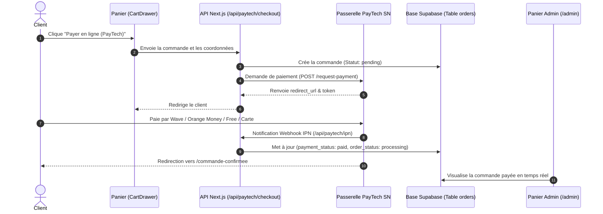

# Guide Complet d'Intégration PayTech SN — MG Perfume Dakar

Ce guide détaille pas à pas la configuration de la passerelle de paiement **PayTech Sénégal** pour votre boutique **MG Perfume** ([www.mg-perfume.com](https://www.mg-perfume.com)).

---

## 1. Création & Activation du Compte Marchand PayTech

1. Rendez-vous sur le site officiel : **[https://www.paytech.sn](https://www.paytech.sn)**.
2. Créez votre compte marchand en sélectionnant le type : **Site E-Commerce**.
3. Renseignez les informations de votre entreprise / boutique.
4. Une fois connecté à votre tableau de bord, contactez si nécessaire le support PayTech (+221 33 820 14 44) pour valider le passage en mode production.

---

## 2. Récupérer vos Clés d'API

1. Dans votre tableau de bord PayTech, allez dans le menu :
   👉 **Paramètres > API & APN** (ou *Développeur*).
2. Vous y trouverez deux identifiants essentiels :
   * **Clé API (API Key)**
   * **Clé Secrète (API Secret)**

---

## 3. Configuration des URLs de Redirection & Webhook (IPN)

Dans votre espace PayTech (ou lors de la configuration de votre application marchand) :

| Paramètre | URL Exacte à Renseigner |
| :--- | :--- |
| **Site Web / Domaine** | `https://www.mg-perfume.com` |
| **URL de Notification Instantanée (IPN)** | `https://www.mg-perfume.com/api/paytech/ipn` |
| **URL de Succès (Success URL)** | `https://www.mg-perfume.com/commande-confirmee` |
| **URL d'Annulation (Cancel URL)** | `https://www.mg-perfume.com/?cart=open` |

---

## 4. Activer les Vrais Paiements sur votre Site

Ouvrez le fichier `.env.local` sur votre serveur (ou configurez les **Environment Variables** sur Vercel / Coolify / Hostinger) :

```env
# Vos clés API PayTech
PAYTECH_API_KEY=votre_cle_api_paytech_ici
PAYTECH_API_SECRET=votre_cle_secrete_paytech_ici

# Basculer de 'test' à 'prod' pour encaisser de vrais paiements
PAYTECH_ENV=prod

# URL officielle du site
NEXT_PUBLIC_SITE_URL=https://www.mg-perfume.com
```

---

## 5. Comment Fonctionne le Flux de Paiement Client



---

## 6. Méthodes de Paiement Supportées par PayTech au Sénégal

En activant PayTech, vos clients à Dakar et dans les régions peuvent régler via :
* 📱 **Wave** (QR Code ou Push Mobile)
* 🍊 **Orange Money Sénégal**
* 🟢 **Free Money**
* 💳 **Cartes Bancaires** (Visa, Mastercard internationales)
* 🏦 **Virement / E-Banking local**

---

## 7. Gestion des Commandes dans l'Admin Panel

* Accédez à : `https://www.mg-perfume.com/admin`
* Ouvrez l'onglet **Commandes** :
  * 🔔 Vous voyez en temps réel les nouvelles commandes avec badge vert.
  * 💳 Les commandes payées par PayTech ont le badge **"Payé (PayTech)"**.
  * 🚚 Vous pouvez mettre à jour le statut en 1 clic (*En préparation*, *En livraison*, *Livrée*).
  * 💬 Cliquez sur **"WhatsApp Client"** pour envoyer directement au client un message de suivi personnalisé pré-rempli avec sa référence `#MGP-...`.

---

## 8. Support Technique PayTech Sénégal

* 📞 **Téléphone** : +221 33 820 14 44
* 🌐 **Documentation** : https://doc.intech.sn/doc_paytech.php
* 📧 **Email** : contact@intech.sn / support@paytech.sn
