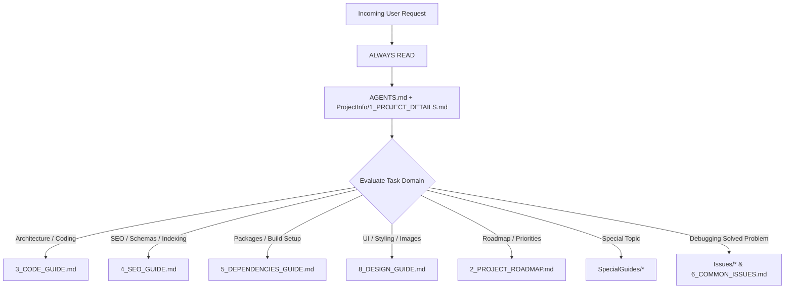

# [9] AI Workflow & Context Architecture Guide

This document defines how AI assistants (such as Antigravity CLI) must interact with the codebase, load context efficiently, and maintain documentation.

---

## 1. AI Context Loading Priority System

To optimize token efficiency and avoid context pollution, AI agents must adhere to the following priority hierarchy:



### Tier 1: ALWAYS READ (Mandatory on Every Session)
* [`AGENTS.md`](file:///data/data/com.termux/files/home/website-template/AGENTS.md) — Permanent engineering guardrails & hard constraints.
* [`ProjectInfo/[1]_PROJECT_DETAILS.md`](file:///data/data/com.termux/files/home/website-template/ProjectInfo/%5B1%5D_PROJECT_DETAILS.md) — Project identity, architecture, and core commands.

### Tier 2: READ WHEN RELEVANT (Domain-Specific Context)
* [`[2]_PROJECT_ROADMAP.md`](file:///data/data/com.termux/files/home/website-template/ProjectInfo/%5B2%5D_PROJECT_ROADMAP.md) ➡️ Read when planning features, checking phase status, or onboarding clients.
* [`[3]_CODE_GUIDE.md`](file:///data/data/com.termux/files/home/website-template/ProjectInfo/%5B3%5D_CODE_GUIDE.md) ➡️ Read when adding/modifying components, editing `src/config/site.ts`, or reviewing conventions.
* [`[4]_SEO_GUIDE.md`](file:///data/data/com.termux/files/home/website-template/ProjectInfo/%5B4%5D_SEO_GUIDE.md) ➡️ Read when touching metadata, JSON-LD schemas, OpenGraph, sitemap, or robots.
* [`[5]_DEPENDENCIES_GUIDE.md`](file:///data/data/com.termux/files/home/website-template/ProjectInfo/%5B5%5D_DEPENDENCIES_GUIDE.md) ➡️ Read when reviewing package dependencies, Next.js config, or Docker settings.
* [`[8]_DESIGN_GUIDE.md`](file:///data/data/com.termux/files/home/website-template/ProjectInfo/%5B8%5D_DESIGN_GUIDE.md) ➡️ Read when modifying visual styles, color tokens, typography, or images.
* [`[9]_AI_WORKFLOW.md`](file:///data/data/com.termux/files/home/website-template/ProjectInfo/%5B9%5D_AI_WORKFLOW.md) ➡️ Read when executing a documentation update or creating Task/Issue records.
* [`SpecialGuides/*`](file:///data/data/com.termux/files/home/website-template/ProjectInfo/SpecialGuides) ➡️ Read only when performing specific operations covered by the deep guide.

### Tier 3: HISTORICAL ARCHIVES (Search / Read Only When Investigating)
* [`ProjectInfo/Tasks/*`](file:///data/data/com.termux/files/home/website-template/ProjectInfo/Tasks) & [`[7]_TASKS_DONE.md`](file:///data/data/com.termux/files/home/website-template/ProjectInfo/%5B7%5D_TASKS_DONE.md)
* [`ProjectInfo/Issues/*`](file:///data/data/com.termux/files/home/website-template/ProjectInfo/Issues) & [`[6]_COMMON_ISSUES.md`](file:///data/data/com.termux/files/home/website-template/ProjectInfo/%5B6%5D_COMMON_ISSUES.md)

---

## 2. Documentation-Update Workflow

> [!IMPORTANT]
> **Documentation is NEVER modified automatically after routine tasks.**
> Documentation updates must happen ONLY when the user explicitly issues a command such as:
> - *"Update documentation"*
> - *"Update the docs"*
> - *"Document this task"*

### Step-by-Step Update Protocol
When an explicit documentation update is requested:
1. **Determine Scope of Changes**: Analyze git status or recent file changes to understand what was modified.
2. **Identify Affected Guides**: Map modified areas to relevant ProjectInfo guides (e.g. new schema ➡️ `[4]_SEO_GUIDE.md`, new design token ➡️ `[8]_DESIGN_GUIDE.md`).
3. **Read Existing Guides**: Read the target guides before editing to preserve structure and avoid duplicates.
4. **Update Guides Comprehensively**: Modify only affected sections. Keep explanations concise and structured.
5. **Create Task Record**: Create a new task record in `ProjectInfo/Tasks/` following the format:
   `[Number]-DD-MM-YYYY-HH-MM_Task_Name.md`
6. **Register in Index**: Add an entry to `ProjectInfo/[7]_TASKS_DONE.md`.
7. **Handle Issues (If Applicable)**: If a recurring or critical problem was solved:
   - Create `ProjectInfo/Issues/[Number]-DD-MM-YYYY-HH-MM_Issue_Name.md`
   - Register it in `ProjectInfo/[6]_COMMON_ISSUES.md`.
8. **Strict Safeguards**:
   - Never modify historical task records.
   - Never modify `[6]_COMMON_ISSUES.md` unless a recurring issue genuinely occurred.
   - Never edit unrelated documentation files.

---

## 3. Record Templates

### Task Record Template (`ProjectInfo/Tasks/[Number]-DD-MM-YYYY-HH-MM_Task_Name.md`)
```markdown
# Task [Number]: <Task Name>

- **Date & Time**: DD-MM-YYYY HH:MM
- **Category**: Architecture | UI/UX | SEO | Feature | Refactor
- **Status**: Completed

## 1. Objective
<Brief description of what needed to be done>

## 2. Changes Implemented
- <Itemized list of changes made>
- <Files created or modified>

## 3. Verification & Testing
- <Build commands executed and results>
- <Verification evidence>

## 4. Impact & Next Steps
<Any follow-up items or architectural impacts>
```

### Issue Record Template (`ProjectInfo/Issues/[Number]-DD-MM-YYYY-HH-MM_Issue_Name.md`)
```markdown
# Issue [Number]: <Issue Name>

- **Date & Time**: DD-MM-YYYY HH:MM
- **Severity**: Low | Medium | High | Critical
- **Category**: Next.js Build | Static Export | Styling | SEO | Deployment
- **Status**: Resolved

## 1. Symptom & Error Log
<Exact error message or undesirable behavior observed>

## 2. Root Cause
<Technical analysis of why the issue occurred>

## 3. Solution & Code Diff
<Step-by-step resolution and code changes>

## 4. Prevention & Rules
<Rule or checklist item to prevent recurrence>
```
